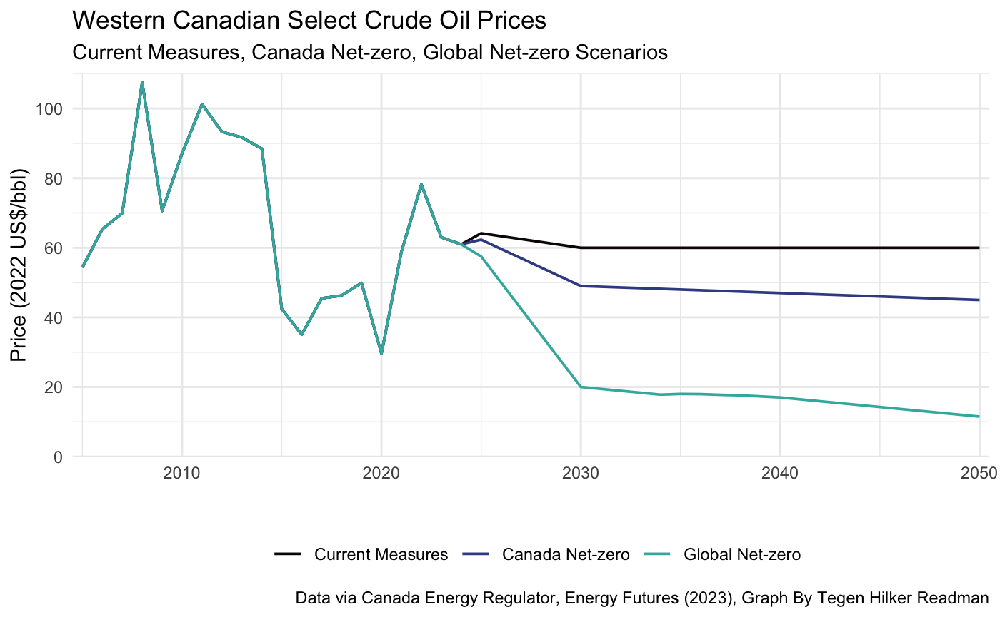
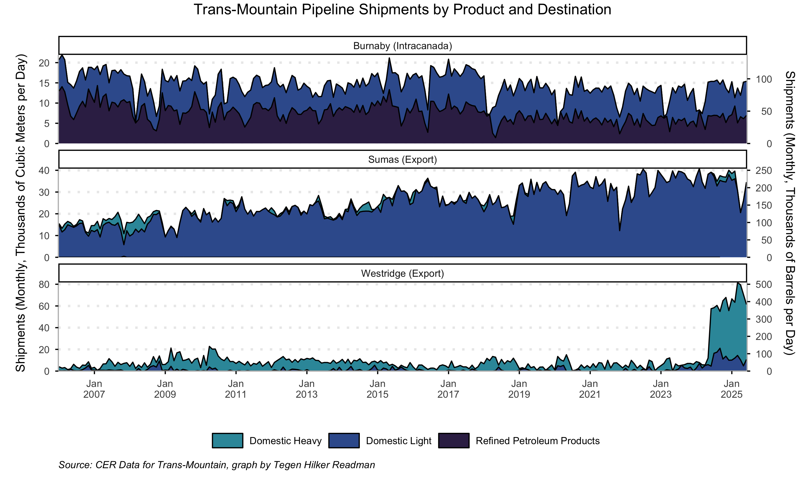

### First Assignment

Question: *"Canada is largely an oil price taker. You’ve made two graphs and a table on oil prices and how they might
respond in each of these three scenarios. What can you tell me about Canada’s potential exposure to
global and domestic action on climate change and/or global energy technology evolution? Make sure you
tell briefly me what each scenario assumes about global and domestic action on climate change, what each
scenario holds for oil prices, and how that might affect Canadian oil production."*

The "Canada's Energy Future 2023" report, detailed by the Canadian Energy Regulator, describes three scenarios: if Canada kept its current climate change measures if Canada goes net-zero by 2050 and similarly if the world followed suit. If Canada were to keep their current climate change measures, the CER predicts that while our emissions would be detrimental to the climate, the price of WCS futures would remain relatively constant to what it is now, ~ 60 $US/bbl. On the other hand, if we were to commit to net-zero emissions by 2050, i.e., where our emissions become negated by various technologies such as carbon capturing and "green" forms of energy, we would see the price of oil fall sharply, and even more, if the world went full net-zero. While that may look un-motivating for our economy, there would still be a small demand for petroleum products such as plastics and lubricants. We just would not be destroying the Earth with our emissions as much. What does this mean for Alberta? We should focus on other industries to prop up our economy rather than just relying on fossil fuels. A bonus is that with our increases in technology, the price for renewable energy will get lower over time. The graph below displays that:

## Second Assignment

### Enbridge Canadian Mainline Shipments by Product

### Trans-Mountain Pipeline Shipments by Product and Destination

### US Crude Imports from Canada and The Rest of The World (ROW)

### TCPL Canadian Mainline Throughput and Capacity (Praries) & TCPL Canadian Mainline Tolls from Empress

### Alberta Royaltie Revenue Over Time

## Assignment 3
### National Electricity Generation by Source

### Electricity Generation by Source, Alberta

### Canadian Electricity Sector GHG Emissions

### Alberta Energy Merit Order, select dates in January at hour ending 19:00

### Electricity Generation By Type

